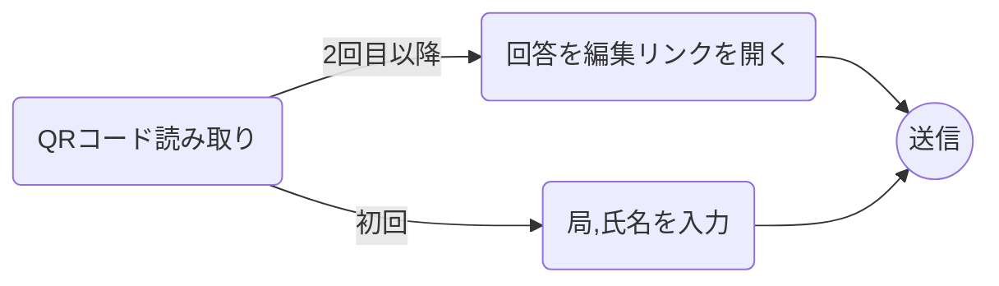

# 概要

これは白山祭で用いる委員が現在いる場所を共有できるWebアプリです．

メンバーがそれぞれ自分の居場所をフォームで回答すると，入力した教室番号が現在地として表示されます．

# 使用方法

1. 部屋ごとに用意してあるQRコードを読み取ってフォームを開きます．教室番号は自動入力されるようになっているので，それ以外の情報（氏名など）を自分で入力します．
   
2. 2回目以降の回答では，QRコードを読み取った後`回答を編集`というリンクを開くと前の情報と現在の教室番号が自動で入力されるため，編集せずに送信します．
   
3. 回答完了画面にあるリンク`https://cocoboard.vercel.app/`を開くと，現在地の一覧を見ることができます．
   

## 使用の流れ

以上の説明を図にするとこのようになります．

# 注意事項

- フォームはQRコードから開き，部屋番号の欄は編集しないようにしてください．

- 2回目の回答は必ず`回答を編集`リンクから行ってください．

- ページを開いている場合は，ページを再読み込みしないと最新の情報が反映されません．